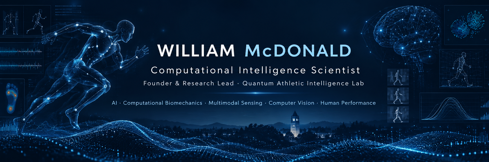

  

# William McDonald

### Computational Intelligence Scientist
**Founder & Research Lead — Quantum Athletic Intelligence Lab**  
**M.S. Applied Data Science — University of North Carolina at Chapel Hill**

Artificial Intelligence · Computational Biomechanics · Multimodal Sensing · Computer Vision · Human Performance

[Google Scholar](https://scholar.google.com/citations?hl=en&user=pvUzyNMAAAAJ) ·
[QAI Lab](https://www.qailab.org/) ·
[Email](mailto:willmcd@unc.edu)

---

## Research Profile

I am a Computational Intelligence Scientist and research engineer working at the intersection of artificial intelligence, human performance, biomechanics, multimodal sensing, and scientific computing.

I founded and lead the **Quantum Athletic Intelligence Lab (QAI Lab)**, an interdisciplinary research institute focused on understanding human performance through artificial intelligence, biomechanics, neuroscience, computer vision, and advanced sensing technologies.

My work centers on the development of computational methods, intelligent systems, research infrastructure, and multimodal analytical pipelines for studying athlete movement, performance, recovery, cognition, and injury risk.

---

## Research Areas

- Computational Intelligence
- Artificial Intelligence & Machine Learning
- Computational Biomechanics
- Human Performance Science
- Computer Vision & Motion Analysis
- Multimodal Sensing & Sensor Fusion
- Large Language Models
- Athlete Intelligence Modeling
- Neuroperformance & Cognitive Performance
- Scientific Data Engineering
- Research Software Engineering

---

## Quantum Athletic Intelligence Lab

**Founder & Research Lead | 2020–Present**

QAI Lab is an interdisciplinary research institute investigating human performance through computational intelligence.

Our research integrates:

- Artificial intelligence and machine learning
- Biomechanics and movement science
- Neuroscience and cognitive performance
- Computer vision and motion analysis
- Wearable and smart sensor systems
- Multimodal athlete data
- Performance, recovery, and injury-risk modeling

### Research Programs

**Computational Athlete Intelligence**  
AI-driven modeling of athlete performance, workload, readiness, fatigue, adaptation, and injury risk.

**Computer Vision & Aerial Tracking**  
Markerless movement analysis and spatial tracking using multi-camera and vision-based systems.

**Smart Sensor Systems**  
Multimodal sensing research involving biomechanical, physiological, and performance signals.

**NeuroPerformance & VR Training**  
Research involving perception, cognition, decision-making, reaction, situational awareness, and immersive training environments.

→ [Quantum Athletic Intelligence Lab](https://www.qailab.org/)

---

## Current Research

### Q-STATE / Q-AIM

A computational research framework for multimodal athlete-state estimation and athlete intelligence.

Research areas include:

- Markerless biomechanics
- Pose estimation
- Movement-quality analysis
- Multimodal data fusion
- Occlusion robustness
- Athlete-state modeling
- Performance analytics

---

### ATHENA

A from-scratch language-model and AI systems research initiative developed as QAI Lab's internal intelligence and research platform.

Current work includes:

- Transformer architecture
- Large-scale training-data pipelines
- Domain-specific pretraining
- Model evaluation
- Quantization and compression
- Local inference
- Agent orchestration
- Scientific reasoning systems

---

### AthleteOS

An athlete-intelligence platform integrating computational methods for athlete monitoring, performance modeling, recovery, nutrition, recruiting, and coaching decision support.

Core systems include:

- RecoverIQ
- PerformanceIQ
- NutritionIQ
- RecruitIQ
- CoachIQ

---

## Selected Publications

### 2026

**Cue Modality Matters: Visual, Auditory, and Audiovisual Triggers in Sports Performance Training**  
Research examining modality-specific cueing, reaction time, perception-action coupling, gaze behavior, and applied sports-performance training.

### 2025

**Smart Training: Leveraging AI and Machine Learning for Injury Prevention and Performance Optimization in Sports**  
Research examining artificial intelligence, machine learning, wearable sensing, computer vision, biomechanical modeling, and multimodal data fusion for athlete performance and injury prevention.

**Analyzing the Potential and Impact of AI/ML Tools in Multi-Domain Learning Environments**

**Foundations of Autonomous Intelligence Systems for STEM Education and Research**

### Research Program

**Q-STATE / Q-AIM**  
Computational framework and empirical research involving markerless biomechanics, pose estimation, multimodal fusion, occlusion robustness, and athlete intelligence.

→ [Google Scholar](https://scholar.google.com/citations?hl=en&user=pvUzyNMAAAAJ)

---

## Academic Research

### University of North Carolina at Chapel Hill

**STAR Heel Performance Lab — Research Collaborator**

Research engineering and applied data-science support for human-performance and sports-science research.

**PSI Lab — Research Collaborator**

Applied data science and research engineering supporting interdisciplinary research workflows.

**UNC Gillings School of Global Public Health — Research Technology Contributor**

Developed computational workflows for processing, coding, and analyzing eye-tracking data from human-subject research.

---

## Selected Research Systems

| System | Research Area |
|---|---|
| **Q-STATE / Q-AIM** | Multimodal athlete-state estimation |
| **ATHENA** | AI systems & language-model research |
| **AthleteOS** | Athlete intelligence & decision support |
| **Project PANTHEON** | Multi-agent AI architecture |
| **Starkid Command** | Aerospace research & STEM technology |
| **ANOVAS** | AI-assisted operational intelligence |

---

## Methods & Technologies

**Artificial Intelligence**  
Machine Learning · Deep Learning · LLMs · Intelligent Agents · Model Evaluation

**Computer Vision**  
OpenCV · MediaPipe · Pose Estimation · Markerless Motion Analysis

**Scientific Computing**  
Python · SQL · JavaScript · PyTorch · Data Analysis · Statistical Computing

**Research Infrastructure**  
Linux · Docker · Git · GitHub · Cloud Computing · Research Data Pipelines

**Multimodal Systems**  
Computer Vision · Wearable Sensors · Eye Tracking · Sensor Fusion · Athlete Data

---

## Education

### University of North Carolina at Chapel Hill
**M.S. Applied Data Science**  
2026–Present

### Capella University
**B.S. Computer Science**  
GPA: 4.0

### Virginia Union University
**B.S. International Business**

---

## Research Links

- [Google Scholar](https://scholar.google.com/citations?hl=en&user=pvUzyNMAAAAJ)
- [Quantum Athletic Intelligence Lab](https://www.qailab.org/)
- [GitHub — The Tech Lab](https://github.com/The-TechLab)
- [Email](mailto:willmcd@unc.edu)

---

> Building computational systems for understanding human performance.
